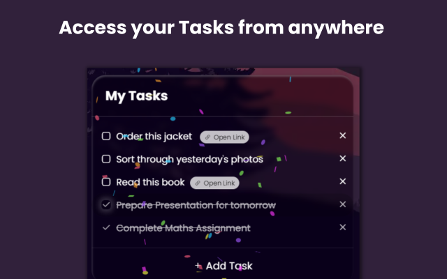
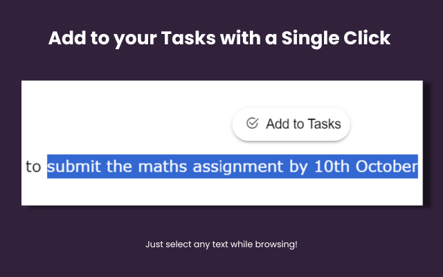

# Browspire - Custom Homepage and ToDo List
By [Divyesh Lakhotia](https://www.linkedin.com/in/divyesh-lakhotia/)

___
Enhance your browsing experience with a modern and comfortable homepage that matches your vibe and boosts your productivity. Customize to your liking!

Browspire can give your New Tab page the most aesthetic look and feel ever. Its simple and customizable UI ensures that your browser truly feels like yours. 

And of course, the best part is - you can access multiple widgets like Spotify, TODO lists, Weather, Quotes & more right from the New Tab page.

------

## Installation For Edge :
This extension will soon be available on Edge Addons Store

------

## Installation For Chrome :
Currently, this extension has not been added to the Chrome Web Store. Hence, to use this extension with Chrome (or Chromium-based browsers like Brave), follow these steps - 

**Installation Instructions For Chrome** :

1. Download this repository as a .zip file
   https://github.com/Divyesh06/browspire/archive/refs/heads/main.zip
3. Unzip the file. 
4. Go to chrome://extensions/
5. Enable 'Developer mode'
6. Click on 'Load Unpacked'
7. Select the `Browspire Chrome Extension` folder from the unzipped folder.

All Done!

----
## All Features

🟣 Show a random wallpaper from our handpicked collection every time. You can also add or remove wallpapers to the collection.

🟣 Access your favorite songs right from the New Tab page with the Spotify Widget.

🟣 Maintain a ToDo list that is accessible anytime while browsing. Select a text from any page and add it to your tasks (along with a link to it), all using a single click!

🟣 Stay motivated with a Quote of the Day

🟣 Access real-time Weather & Date on your New Tab page

  
